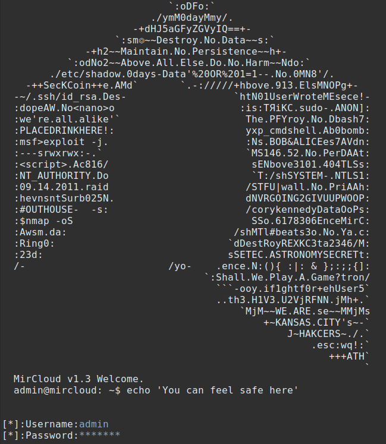

# mircLoud - A heavily encrypted File Storage 
Encrypted file storage and synchronization service, that can be used localy and globaly.

 [](https://twitter.com/intent/tweet?text=Do%20you%20plan%20to%20make%20a%20home%20server%3F%20Look%20no%20further.%20Mircloud%20is%20the%20right%20tool%20for%20the%20job.&url=https://github.com/mirkonikic/mircloud&hashtags=tech,homelab)


<!---->

**Usage**
---

```
Usage: java -jar mircloud_cli.jar [OPTIONS]

  Goal of this project is privacy of file transfering process, no MITM or Sniffing from colleagues, ISPs, GOVs or strangers.
  Developed by Mirko Nikic -> (Github: mirkonikic)


Options:
  -ip <ip address v4>        Specify ip address of server.
  -p  <port number>          Specify port number of server.
  -h                         Show this message and exit.
```

**Installation Options**
---

1. Only requirement for this program to work is installed Java.

2. Download the `mircloud_cli.jar` program from mircloud/ directory.


**How to Contribute**
---

1. Clone repo and create a new branch: `$ git checkout https://github.com/mirkonikic/mircloud -b name_for_new_branch`.
2. Make changes and test
3. Submit Pull Request with comprehensive description of changes
4. Ill review it and merge if nothing is against the privacy of users of this program.

**Acknowledgements**
---


**Donations**
---

This is free, open-source software. If you'd like to support the development of future projects, or say thanks for this one, you can donate BTC at `address will be added`.

**Future Upgrades**
---
- [ ] Encrypted       - No Sniffing of data or MITM attacks (When finished)
- [ ] Privacy         - No one except you will know what files are you sending on server (When finished)
- [x] Remote Controll - If isAdministrator is set to true, you can use this program for Remote Control
- [x] > Google Drive  - While Google and other Drives Limit your storage size, with this program you can use your whole Drive
- [x] Multi-User      - Multiple number of users logged in at the same time and not limited number of users registered
  
